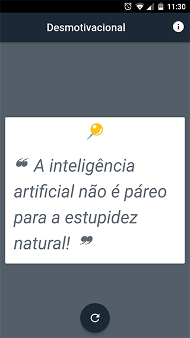

# desmotivacional-app
> Frases desmotivacionais em seu dispositivo :vibration_mode:

:pencil: _**Nota:** O objetivo deste app não é promover nenhum tipo de bullyng mas sim dá aquele lembrete de que nem tudo são flores._


## Preview

  


## Pré-requisitos
Assumindo que você já tenha o Node instalado em sua máquina.
Tenha  a versão mais recente do ionic e cordova.
```
npm install -g ionic@latest
npm install -g cordova
```
## Como usar
Assumindo que você já tenha o Git instalado como pré-requisito.
```
git clone https://github.com/welksonramos/desmotivacional-app.git
cd desmotivacional-app
npm install
ionic cordova platform add ios
ionic cordova platform add android
```
Você pode testar localmente com o comando:
```
ionic serve
ionic cordova run ios --prod
ionic cordova run android --prod
```
O primeiro comando roda a aplicação em seu navegador, enquanto os outros rodam em um dispositivo real conectado via usb ou no emulador.

**Nota**: que alguns recursos nativos do Ionic podem não funcionar no navegador (Ex: armazenamento em cache).


### Ícones & Splash Screen
As imagens estão localizadas no diretório  `/resources/`.

Execute o comando:
``` 
ionic cordova resources android
ionic cordova resources ios
```

## Relacionado

- [desmotivacional-cli](https://github.com/welksonramos/desmotivacional-cli) - Mensagens desmotivacionais via linha de comando
## LICENÇA
[MIT LICENSE](LICENSE.md) &copy; Welkson Ramos
